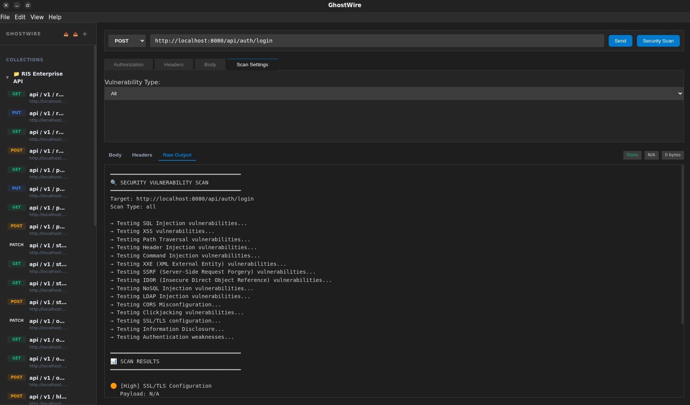

# 👻 GhostWire

**GhostWire** is a premium, security-focused HTTP client built with Electron, React, and Go. It combines the ease of use of a modern API client with professional-grade security scanning capabilities, all wrapped in a sleek VS Code-inspired interface.



## ✨ Features

- **VS Code Aesthetic**: A native-feeling dark theme based on the VS Code Dark+ palette.
- **Security Scanning**: Deeply integrated security scanner that detects SQLi, XSS, SSRF, IDOR, and more.
- **Advanced Auth**: Support for Bearer Tokens and Basic Authentication.
- **Collapsible Collections**: Organize your requests with ease using nested, collapsible collections.
- **Global CLI Integration**: Powered by a high-performance Go-based backend (`httpcli`).
- **Dual Metadata View**: Inspect both Request and Response headers side-by-side.

## 🚀 How to Use

### 1. Prerequisites
GhostWire requires the **httpcli** security tool to be installed globally on your system.

**Install httpcli from source:**
```bash
# Clone the security-cli repository
git clone https://github.com/cyrenus-sec/http-cli.git
cd http-cli

# Build and install to your PATH ( linux ) see http-cli main repo for other systems 
go build -o httpcli main.go
sudo mv httpcli /usr/local/bin/
```

### 2. Running the App
Download the latest [Release](https://github.com/cyrenus-sec/ghostwire/releases) and launch the AppImage or executable.

Inside the app:
- **Send Requests**: Enter your URL, method, and headers/body.
- **Run Scans**: Toggle the **Security Scan** option to identify vulnerabilities.
- **Manage Collections**: Use the sidebar to group requests and export/import them as JSON.

## 🛠️ Building from Source

If you want to build GhostWire yourself, follow these steps:

### Prerequisites
- [Node.js](https://nodejs.org/) (v18+)
- [Go](https://golang.org/) (if building the CLI from source)
- [npm](https://www.npmjs.com/)

### Steps

1. **Clone the repository:**
   ```bash
   git clone git@github.com:cyrenus-sec/ghostwire.git
   cd ghostwire
   ```

2. **Install dependencies:**
   ```bash
   npm install
   ```

3. **Development Mode:**
   To run the app in development with Hot Module Replacement (HMR):
   ```bash
   # Window 1: React dev server
   npm run dev:react
   
   # Window 2: Electron runner
   npm run dev:electron
   ```

4. **Build Production Assets:**
   ```bash
   npm run build
   ```

5. **Generate Packaged Binaries:**
   ```bash
   # For Linux (AppImage)
   npm run dist:linux
   
   # For Windows (.exe)
   npm run dist:win
   
   # For macOS (.dmg)
   npm run dist:mac
   ```

The packaged output will be available in the `/dist` directory.

## 📜 License
GhostWire is licensed under the MIT License. Developed for security enthusiasts and professionals.
