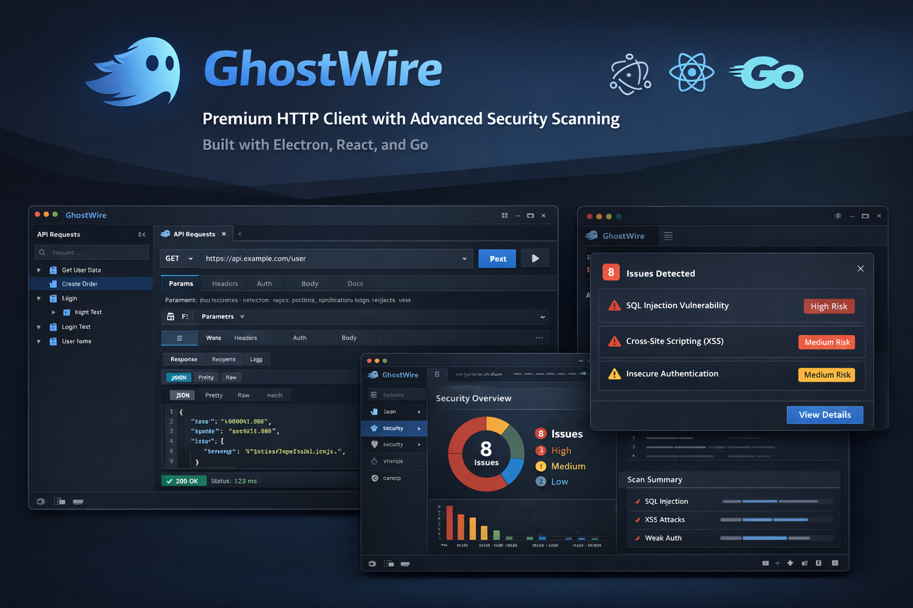

# 👻 GhostWire

**GhostWire** is a premium, security-focused HTTP client built with Electron, React, and Go. It combines the ease of use of a modern API client with professional-grade security scanning capabilities, all wrapped in a sleek VS Code-inspired interface.




## ✨ Features

- **VS Code Aesthetic**: A native-feeling dark theme based on the VS Code Dark+ palette.
- **Security Scanning**: Deeply integrated security scanner that detects SQLi, XSS, SSRF, IDOR, and more.
- **Advanced Auth**: Support for Bearer Tokens and Basic Authentication.
- **Collapsible Collections**: Organize your requests with ease using nested, collapsible collections.
- **Global CLI Integration**: Powered by a high-performance Go-based backend (`httpcli`).
- **Dual Metadata View**: Inspect both Request and Response headers side-by-side.

## 🚀 Quick Start (For End Users)

### 1. Install httpcli
Download and install the pre-built `httpcli` binary from the [http-cli releases](https://github.com/cyrenus-sec/http-cli/releases).

### 2. Download GhostWire
Download the latest [GhostWire Release](https://github.com/cyrenus-sec/ghostwire/releases) and launch the AppImage or executable.

### 3. Start Using
Inside the app:
- **Send Requests**: Enter your URL, method, and headers/body.
- **Run Scans**: Toggle the **Security Scan** option to identify vulnerabilities.
- **Manage Collections**: Use the sidebar to group requests and export/import them as JSON.

---

## 🛠️ Developer Guide (Building from Source)

### Prerequisites

Before building GhostWire, ensure you have:
- [Node.js](https://nodejs.org/) (v18+)
- [Go](https://golang.org/) (v1.19+)
- [npm](https://www.npmjs.com/)

### Setup Instructions

#### 1. Clone the Repository

Clone with submodules to automatically include the `http-cli` dependency:

```bash
git clone --recurse-submodules git@github.com:cyrenus-sec/ghostwire.git
cd ghostwire
```

> [!IMPORTANT]
> If you already cloned without `--recurse-submodules`, initialize the submodule manually:
> ```bash
> git submodule update --init
> ```

#### 2. Build the httpcli Backend

The `http-cli` repository is included as a git submodule. Build it:

```bash
cd http-cli
go build -o httpcli main.go
sudo mv httpcli /usr/local/bin/
cd ..
```

#### 3. Install Node Dependencies

```bash
npm install
```

#### 4. Development Mode

Run the app in development with Hot Module Replacement (HMR):

```bash
# Terminal 1: Start React dev server
npm run dev:react

# Terminal 2: Start Electron
npm run dev:electron
```

#### 5. Build Production Assets

```bash
npm run build
```

#### 6. Generate Packaged Binaries

```bash
# For Linux (AppImage)
npm run dist:linux

# For Windows (.exe)
npm run dist:win

# For macOS (.dmg)
npm run dist:mac
```

The packaged output will be available in the `/dist` directory.

---

## 📜 License

GhostWire is licensed under the MIT License. Developed for security enthusiasts and professionals.
